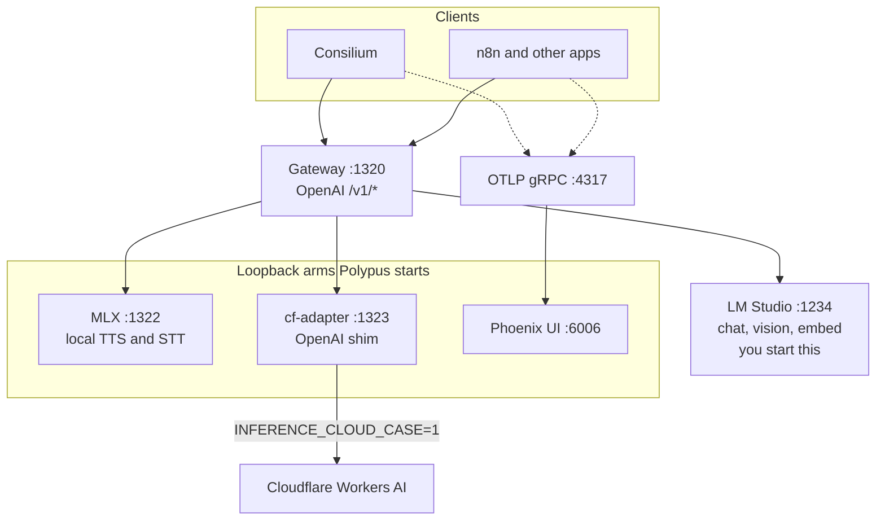

# Polypus

Local **OpenAI-compatible inference gateway**: one loopback face on `:1320`, many backend arms (chat, vision, embeddings, TTS/STT). Clients never talk to Cloudflare, MLX, or LM Studio directly.

**Consilium integration:** submodule at `providers/polypus/` in the Consilium case repo; `make polypus-serve` from that repo root (own process-compose TUI).

## Services

Apps call **only** `http://127.0.0.1:1320`. The gateway routes by model prefix (`cf_local/…`, `lm_studio/…`) or capability default in `config.yaml`.



| Process-compose | Port | What it is |
|-----------------|------|------------|
| `gateway` (`core`) | `:1320` | Public OpenAI API. This is `POLYPUS_BASE_URL`. |
| `mlx` (`mlx`) | `:1322` | Local Apple Silicon speech (Qwen3 TTS, Whisper STT). |
| `cf-adapter` (`cloud`) | `:1323` | Loopback OpenAI shim to Cloudflare Workers AI. Opt-in only (`INFERENCE_CLOUD_CASE=1`). |
| `phoenix` (`obs`) | `:6006` / `:4317` | Arize trace UI and OTLP collector. Clients set `openinference.endpoint` to `localhost:4317`. |
| (external) | `:1234` | LM Studio. Not started by Polypus. |

**cf-adapter in one line:** Cloudflare’s inference URL is not a full OpenAI server, and case apps must not store remote cloud URLs. The adapter binds localhost only, speaks OpenAI to Polypus, and forwards chat, vision, TTS, and STT to Workers AI when you opt in.

## Quick start (Apple Silicon)

```bash
make mlx-sync
make serve        # process-compose TUI: gateway :1320 + backends + Phoenix :6006
make serve-down   # stop this Polypus project only
make smoke        # → /tmp/polypus-smoke.mp3
make smoke-stt    # TTS then STT round-trip
```

`INFERENCE_CLOUD_CASE=1` starts the Cloudflare adapter (`:1323`) instead of MLX. Set `POLYPUS_ENABLE_MLX=1` to run MLX as well. Phoenix (Arize) is on by default (`POLYPUS_PHOENIX=0` to skip): UI http://127.0.0.1:6006 , OTLP gRPC `:4317`. Clients (Consilium, n8n) point `openinference.endpoint` at `localhost:4317`.

Fallback without process-compose: `make serve-legacy`.

## Layout

```text
polypus/
  cmd/polypus/           # Go gateway binary
  internal/gateway/     # HTTP surface (/health, /v1/models, chat/embed/audio)
  internal/router/      # Bifrost SDK: proxies speech/STT to backends; registry + policy
  config.yaml.example   # optional multi-backend table (A7)
  backends/mlx/         # uv + mlx-audio (host only)
  process-compose.yaml  # independent TUI (make serve)
  scripts/pc-up.sh      # process-compose launcher
  scripts/serve-all.sh  # bash fallback (make serve-legacy)
```

## OpenAI surface

| Method | Path | Purpose |
|--------|------|---------|
| `GET` | `/health` | Liveness + backend summary |
| `GET` | `/v1/models` | Aggregate catalog (OpenAI Models API) |
| `GET` | `/v1/models/{id}` | Retrieve one model |
| `POST` | `/v1/chat/completions` | Chat + vision |
| `POST` | `/v1/embeddings` | Embeddings |
| `POST` | `/v1/audio/speech` | TTS |
| `POST` | `/v1/audio/transcriptions` | STT |
| `GET` | `/v1/audio/voices` | Voice list |

Model ids from backends are rewritten as `backend_id/downstream-model` so tools can pass them straight into chat/embed/speech.

**Inventory vs enabled**

| Call | Meaning |
|------|---------|
| `GET /v1/models` | **Enabled** only (`models.allow` on each backend when set) |
| `GET /v1/models?view=inventory` | Full synced inventory (all upstream models) |
| POST chat/embed/speech | Rejected with `model_not_allowed` if allow is set and the model is not listed |

Cloudflare models appear through **cf-adapter** (`:1323`), which maps Workers AI **Model Search** into OpenAI `/v1/models`. Polypus never calls Cloudflare directly.

```bash
curl -sS http://127.0.0.1:1320/v1/models | jq .
curl -sS 'http://127.0.0.1:1320/v1/models?view=inventory' | jq .
curl -sS http://127.0.0.1:1323/v1/models | jq .   # raw CF catalogue via adapter
```

Backends without `/v1/models` still seed `POLYPUS_DEFAULT_MODEL` / `POLYPUS_DEFAULT_STT_MODEL` (when allowed). Optional disk cache: `POLYPUS_MODELS_CACHE` / `POLYPUS_ROOT/.polypus/models-inventory.json`.

## Ports

| Service | Default | Notes |
|---------|---------|-------|
| Gateway | `127.0.0.1:1320` | Public OpenAI `/v1/*` surface |
| MLX backend | `127.0.0.1:1322` | Internal; not for Consilium callers |
| CF adapter | `127.0.0.1:1323` | Cloudflare Model Search + inference |
| Phoenix UI | `127.0.0.1:6006` | Arize traces |
| Phoenix OTLP | `127.0.0.1:4317` | OTLP gRPC (OpenInference) |

## Environment

```env
POLYPUS_HOST=127.0.0.1
POLYPUS_PORT=1320
POLYPUS_BASE_URL=http://127.0.0.1:1320
POLYPUS_MLX_HOST=127.0.0.1
POLYPUS_MLX_PORT=1322
POLYPUS_DEFAULT_MODEL=mlx-community/Qwen3-TTS-12Hz-1.7B-CustomVoice-bf16
POLYPUS_DEFAULT_STT_MODEL=mlx-community/whisper-large-v3-turbo-asr-fp16
POLYPUS_DEFAULT_VOICE=vivian
POLYPUS_PHOENIX=1
```

From Consilium repo root: `make polypus-sync`, `make polypus-serve`, `make polypus-down`.

Multi-backend routing: copy `config.yaml.example` → `config.yaml` for extra loopback backends. Model prefix: `backend_id/model` (e.g. `alt_stt/whisper-large-v3`).

## Docker

Gateway image (MLX still on the host) and Phoenix:

```bash
make mlx-serve                         # host terminal 1 (MLX :1322)
docker compose up polypus              # gateway image → host.docker.internal:1322
# or Phoenix only:
docker compose up phoenix              # UI :6006, OTLP :4317
```

## MLX known issues

See Consilium `docs/planned/core-infrastructure/local-tts.md` § Known stack issues (`serve_launcher.py`, transformers pin).

## License

Part of the Xynova Consilium ecosystem. Breach model: case narration never leaves localhost.
