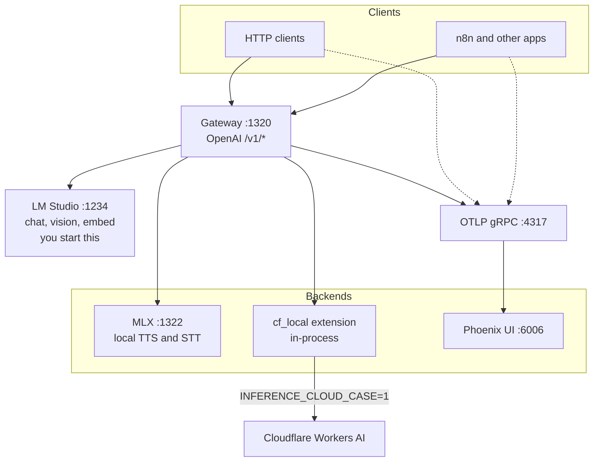

# Polypus

Local **OpenAI-compatible inference gateway**: one loopback face on `:1320`, many backend arms (chat, vision, embeddings, TTS/STT). Clients never talk to Cloudflare, MLX, or LM Studio directly.

## Services

Apps call **only** `http://127.0.0.1:1320`. The gateway routes by model prefix (`cf_local/…`, `lm_studio/…`) or capability default in `config.yaml`.



| Process-compose | Port | What it is |
|-----------------|------|------------|
| `gateway` (`core`) | `:1320` | Public OpenAI API. This is `POLYPUS_BASE_URL`. |
| `mlx` (`mlx`) | `:1322` | Local Apple Silicon speech (Qwen3 TTS, Whisper STT). |
| `phoenix` (`obs`) | `:6006` / `:4317` | Arize trace UI and OTLP collector. Clients set `openinference.endpoint` to `localhost:4317`. |
| (external) | `:1234` | LM Studio. Not started by Polypus. |

**Cloudflare (`cf_local`):** When `INFERENCE_CLOUD_CASE=1`, the gateway calls Workers AI in-process via a **Cloudflare extension** (Model Search catalog + `/ai/run` audio). No sidecar on `:1323`. Case apps still never store remote URLs; credentials live in `stack/.env` only.

## Quick start (Apple Silicon)

```bash
mkdir -p ~/.config/polypus
cp config.yaml.example ~/.config/polypus/config.yaml   # once; edit allow-lists there
make mlx-sync
make build        # gateway bin/polypus
make serve        # process-compose TUI: gateway :1320 + backends + Phoenix :6006
make serve-down   # stop this Polypus project only
make smoke        # → /tmp/polypus-smoke.mp3
make smoke-stt    # TTS then STT round-trip
make smoke-chat   # L1 chat transport (cf_local model when cloud enabled)
```

Live router config: **`~/.config/polypus/config.yaml`** (or `$XDG_CONFIG_HOME/polypus/config.yaml`). Override with `POLYPUS_CONFIG`. Repo `config.yaml` is a local fallback only (gitignored). Cache: `~/.cache/polypus/`; process-compose socket: `~/.local/state/polypus/`.

`INFERENCE_CLOUD_CASE=1` in `stack/.env` enables the `cf_local` remote backend (requires `CF_AI_API_KEY`, `CF_ACCOUNT_ID`). Set `POLYPUS_ENABLE_MLX=1` to run MLX as well when cloud is default for speech. Phoenix (Arize) is on by default (`POLYPUS_PHOENIX=0` to skip): UI http://127.0.0.1:6006 , OTLP gRPC `:4317`.

Disable gateway tracing with `POLYPUS_OTEL=0`. Override collector with `POLYPUS_OTLP_ENDPOINT` and dumps with `POLYPUS_FAILURE_DUMP_DIR`. Skip probe noise with `POLYPUS_OTEL_SKIP_PATHS` (default `/health,/health/backends`).

## Live smoke (cloud)

Prereqs in `stack/.env`:

```env
INFERENCE_CLOUD_CASE=1
CF_AI_API_KEY=...
CF_ACCOUNT_ID=...
```

```bash
make build
make serve
make smoke-chat     # cf_local/@cf/google/gemma-4-26b-a4b-it
make smoke-stt      # when cf_local is default TTS/STT
```

Optional deeper model probe (when your workspace ships a harness):

```bash
# example: tier L1 chat probe against a cf_local model id
make smoke-chat
```

## Layout

```text
polypus/
  cmd/polypus/                    # Go gateway binary
  internal/gateway/               # HTTP surface (/health, /v1/models, chat/embed/audio)
  internal/router/                # Bifrost SDK + registry + policy
  internal/extension/cloudflare/  # Model Search + /ai/run speech (P7)
  config.yaml.example             # template → ~/.config/polypus/config.yaml
  backends/mlx/                   # uv + mlx-audio (host only)
  process-compose.yaml            # independent TUI (make serve)
  scripts/pc-up.sh                # process-compose launcher
```

## OpenAI surface

| Method | Path | Purpose |
|--------|------|---------|
| `GET` | `/health` | Gateway liveness; lists configured backends (no upstream probe) |
| `GET` | `/health/backends` | Upstream reachability probe; `503` when any backend fails |
| `GET` | `/v1/models` | Aggregate catalog (OpenAI Models API) |
| `GET` | `/v1/models/{id}` | Retrieve one model |
| `POST` | `/v1/chat/completions` | Chat + vision |
| `POST` | `/v1/embeddings` | Embeddings |
| `POST` | `/v1/audio/speech` | TTS |
| `POST` | `/v1/audio/transcriptions` | STT |
| `GET` | `/v1/audio/voices` | Voice list |

**Inventory vs enabled**

| Call | Meaning |
|------|---------|
| `GET /v1/models` | **Enabled** only (`models.allow` on each backend when set) |
| `GET /v1/models?view=inventory` | Full synced inventory (all upstream models) |
| POST chat/embed/speech | Rejected with `model_not_allowed` if allow is set and the model is not listed |

Cloudflare models sync via **Model Search** inside the gateway when `cf_local` has `extension: cloudflare`.

```bash
curl -sS http://127.0.0.1:1320/v1/models | jq .
curl -sS 'http://127.0.0.1:1320/v1/models?view=inventory' | jq .
```

## Ports

| Service | Default | Notes |
|---------|---------|-------|
| Gateway | `127.0.0.1:1320` | Public OpenAI `/v1/*` surface |
| MLX backend | `127.0.0.1:1322` | Internal; gateway proxies only |
| Phoenix UI | `127.0.0.1:6006` | Arize traces |
| Phoenix OTLP | `127.0.0.1:4317` | OTLP gRPC (OpenInference) |

## Environment

```env
POLYPUS_HOST=127.0.0.1
POLYPUS_PORT=1320
POLYPUS_BASE_URL=http://127.0.0.1:1320
POLYPUS_MLX_HOST=127.0.0.1
POLYPUS_MLX_PORT=1322
INFERENCE_CLOUD_CASE=1          # enables cf_local remote backend
CF_AI_API_KEY=...
CF_ACCOUNT_ID=...
POLYPUS_CF_TTS_MODEL=@cf/deepgram/aura-2-en
POLYPUS_CF_STT_MODEL=@cf/deepgram/nova-3
POLYPUS_CF_VOICE=luna
```

Hop timeouts live in `config.yaml` `timeouts:` (chat 120s, Cloudflare chat 60s, thinking 600s, vision 300s). Optional client header `X-Polypus-Timeout` (Go duration or integer seconds) is clamped to `min`..`max` (5s–900s).

Multi-backend routing: see `config.yaml.example`. Model prefix: `backend_id/model` (e.g. `cf_local/@cf/zai-org/glm-4.7-flash`).

## Docker

Phoenix only (gateway runs on the host via `make serve`):

```bash
make serve                             # host: gateway + backends + Phoenix
docker compose up phoenix              # Phoenix alone: UI :6006, OTLP :4317
make docker-build                      # optional gateway image (Dockerfile)
```

## Operator agent (ai-copilots)

Configure, smoke-test, and troubleshoot Polypus via the operator pack under `ai-copilots/`. See [ai-copilots/README.md](ai-copilots/README.md).

## Shared Cursor packs

Go quality / review skills come from [xynova/cursor-packs](https://github.com/xynova/cursor-packs) at `.cursor/packs/shared`.

```bash
git submodule update --init --recursive
.cursor/packs/shared/scripts/link-into-project.sh --project .
```

Product skill `polypus-operator` stays under `ai-copilots/` (symlinked into `.cursor/skills/`).

## License

See repository license. Cloud speech (`cf_local`) sends audio/text to Cloudflare only when `INFERENCE_CLOUD_CASE=1` and keys are set.
